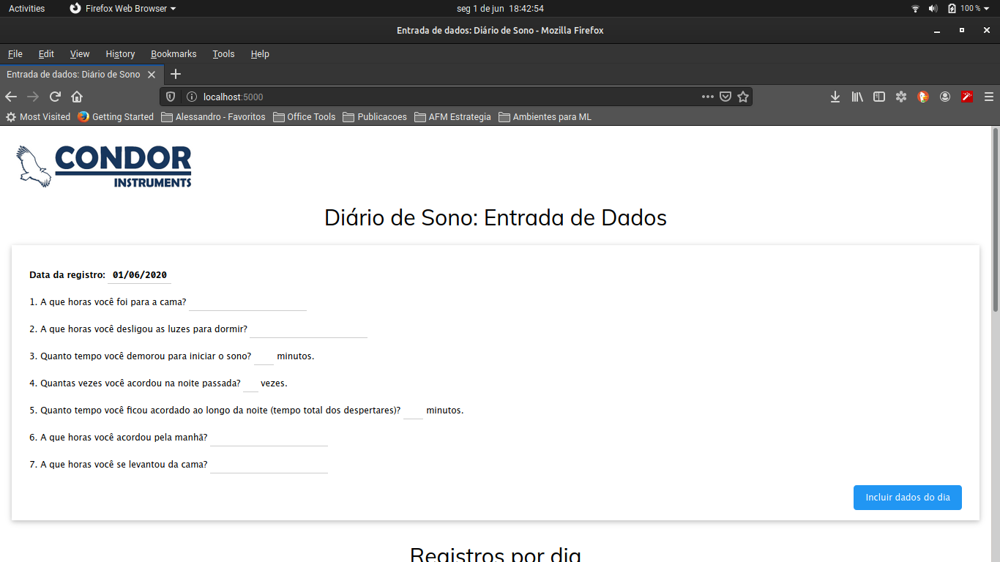
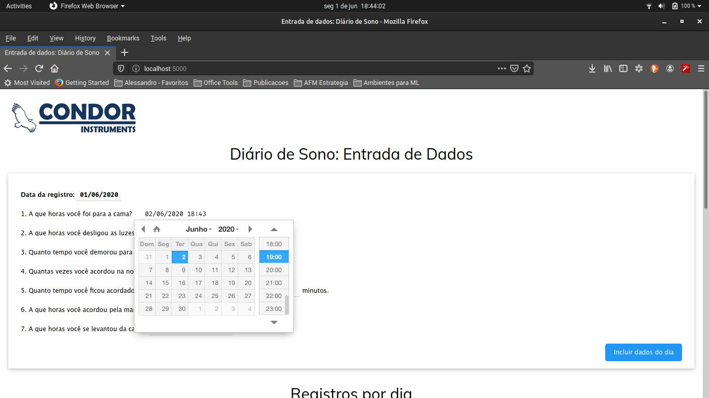
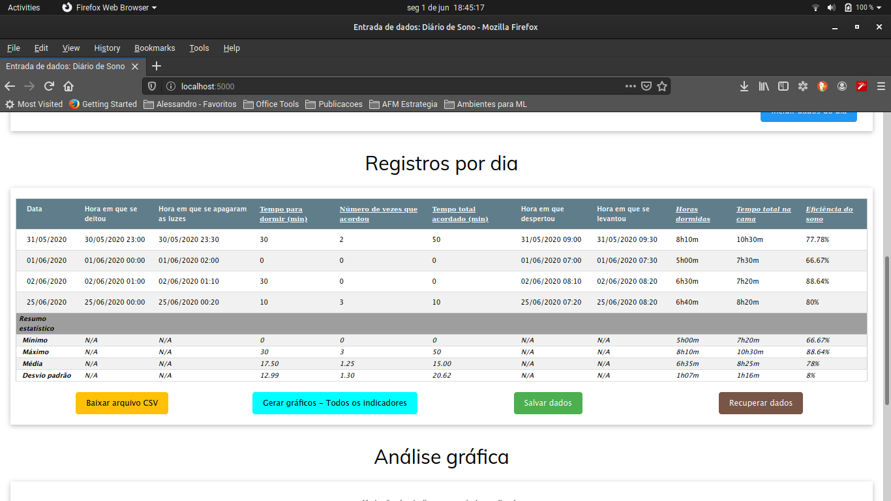
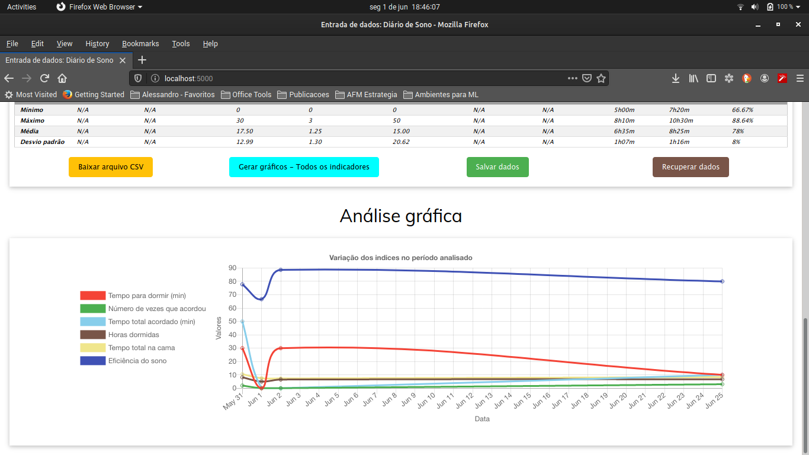
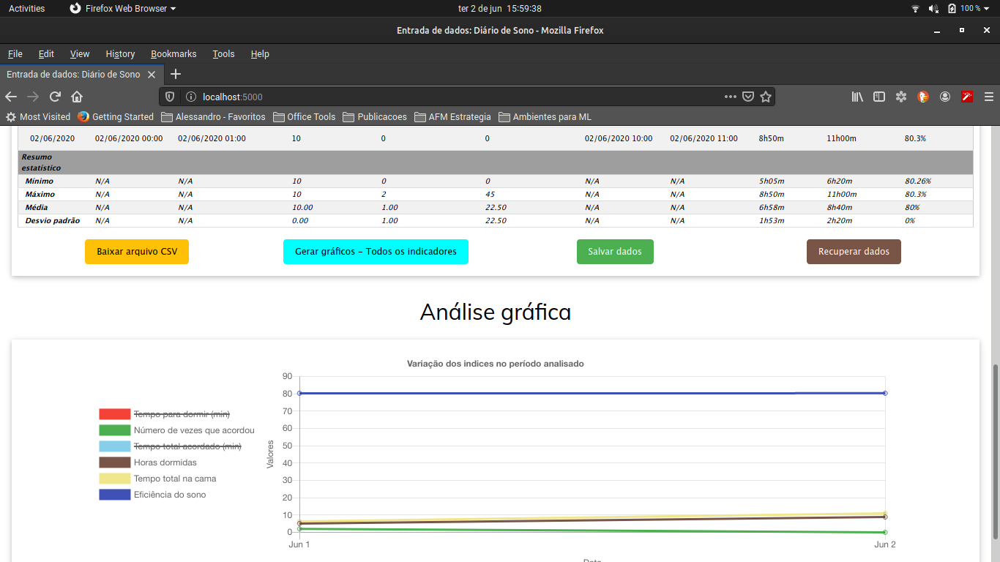
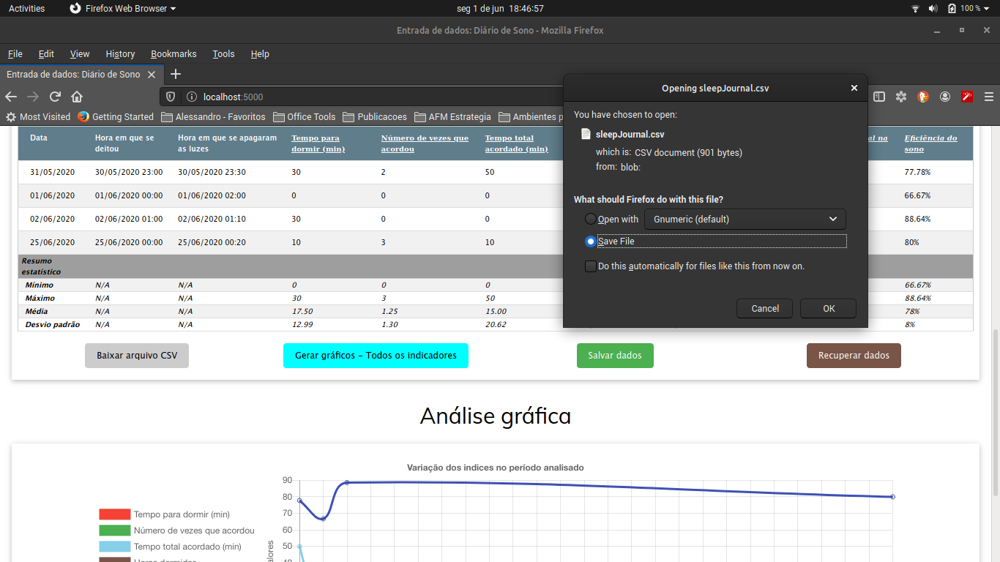
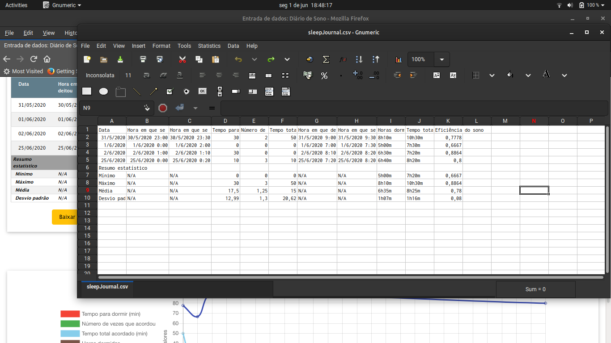
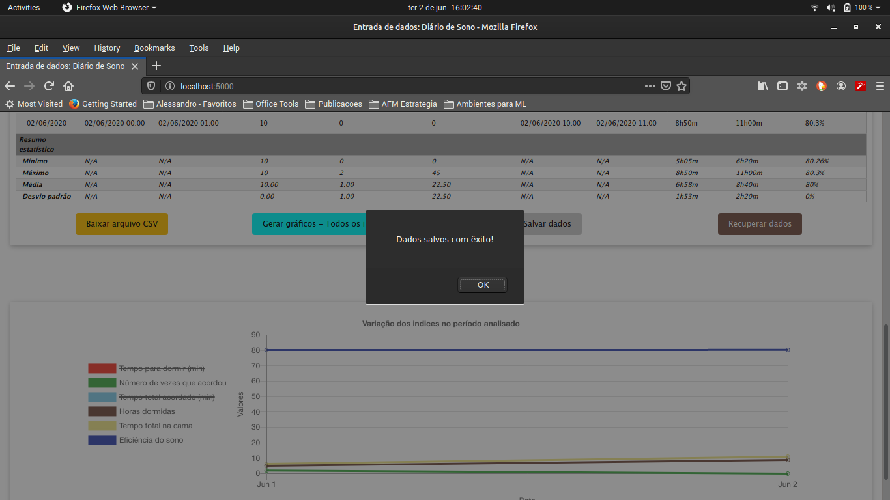
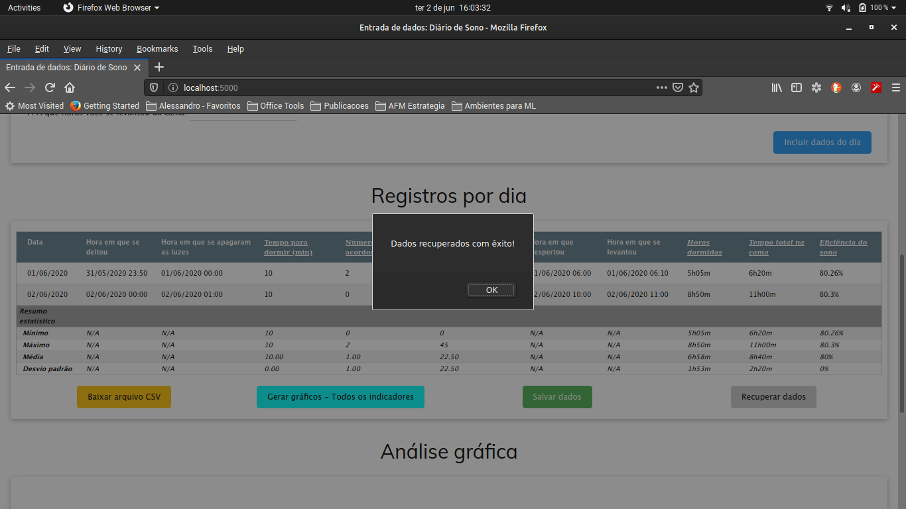

# Teste técnico para a Condor Instruments – Diário de Sono

Autor: Alessandro F. Martins

Versão: 0.1α

-----

## Introdução

A aplicação aqui descrita e disponível para *download* e instalação faz parte do teste técnico da Condor Instruments para a posição de *Lead Developer/Software Architect*. Trata-se de uma agenda em aplicação Web para registro de atividades de sono, possibilitando seu acompanhamento e análise estatística. A aplicação oferece as seguintes funcionalidades:

- Entrada de dados com calendários *pop-up* auto-ajustáveis
- Cálculo automático de dados como *Horas totais dormidas*, *Tempo total na cama* e *Eficiência do sono*
- Cálculo de estatísticas como valores máximos, mínimos, média e desvio padrão.
- *Download*  dos dados em arquivo CSV
- Gravação e recuperação dos dados no servidor.

## Instalação

### Pré-requisitos:

1. Git (apenas para instalação, no caso do método de clonagem de repositório abaixo descrito)
2. SQLite (DBMS)
3. Python 3.x com instalação de PIP

### Instruções rápidas:

1. Clone o repositório Github a partir do seguinte endereço: `https://github.com/alessandro-f-martins/condor_teste`.

   a) *Método 1: Clonagem*:

   1. Crie o diretório onde pretende realizar a instalação (p. ex., "*sleep_journal*")

   2. Entre neste diretório via console e digite o seguinte comando:

      ```shell
      $ cd sleep_journal
      $ git clone https://github.com/alessandro-f-martins/condor_teste .
      ```

   b) *Método 2: Download do arquivo .zip*

   1. Visitando a URL acima via browser, faça o download do arquivo no botão *Clone or download > Download ZIP*
   2. Coloque este arquivo no diretório criado acima e descompacte-o. 

2.  A partir do console, instale (ou verifique a instalação) das bibliotecas Python necessárias. Elas estão descritas no arquivo `requirements.txt` e são instaladas diretamente pela aplicação `pip`, que normalmente se encontra nas instalações do ambiente Python. No exemplo abaixo, a instalação será realizada em um *ambiente virtual*, para que não se afetem os demais ambientes e variáveis da máquina *host*.

   ```shell
   $ virtualenv condor_venv
   $ . condor_venv/bin/activate (LINUX), ou
   $ condor_venv/bin/activate.bat (WINDOWS)
   $ pip install -U -r requirements.txt
   ```

3. Ajuste o arquivo de configuração `.flaskenv` de acordo com a sua estrutura de diretórios:

   ```shell
   # Variaveis de ambiente para a aplicacao Condor - Diario de Sono:
   
   ENV_BASE_DIR=${VIRTUAL_ENV}
   FLASK_APP=${ENV_BASE_DIR}/../webapp/sleep_journal.py
   FLASK_ENV=development
   FLASK_RUN_PORT=5000
   FLASK_RUN_HOST=0.0.0.0
   
   # Variaveis de conexao ao banco de dados:
   
   DB_PATH = '<DIRETORIO DE INSTALACAO>/db/sleepJournal.db'
   ```

4. Execute o servidor com o seguinte comando:

   ```shell
   $ flask run
   ```

5. Acesse o aplicativo via browser em `http://localhost:5000`


## Operação

A aplicação é bastante intuitiva e atende aos requerimentos descritos no documento 

[Desafio Prog Senior_Tec Lead_202001.pdf](docs/Desafio%20Prog%20Senior_Tec%20Lead_202001.pdf), fornecido pela Condor Instruments como referência. Os principais pontos de sua operação podem ser seguidos com as capturas de tela abaixo:


### a) Entrada de Dados:




### b) Calendário *pop-up* para inserção de datas:




### c) Tabela de Registros:




### d) Análise gráfica:



Os gráficos podem ser acessados pelo botão *Gerar gráficos - Todos os indicadores*, gerando para todos índices relevantes, ou de forma individual clicando-se nos cabeçalhos em *<u>sublinhado itálico</u>*. 

Na tela com todos os indicadores à mostra, pode-se ocultar um ou mais deles clicando-se em sua legenda:




### e) Gravação dos dados em arquivo CSV:




### f) Visualização do arquivo CSV:




### g) Salvando os dados no servidor:




### h) Recuperando dados previamente salvos



